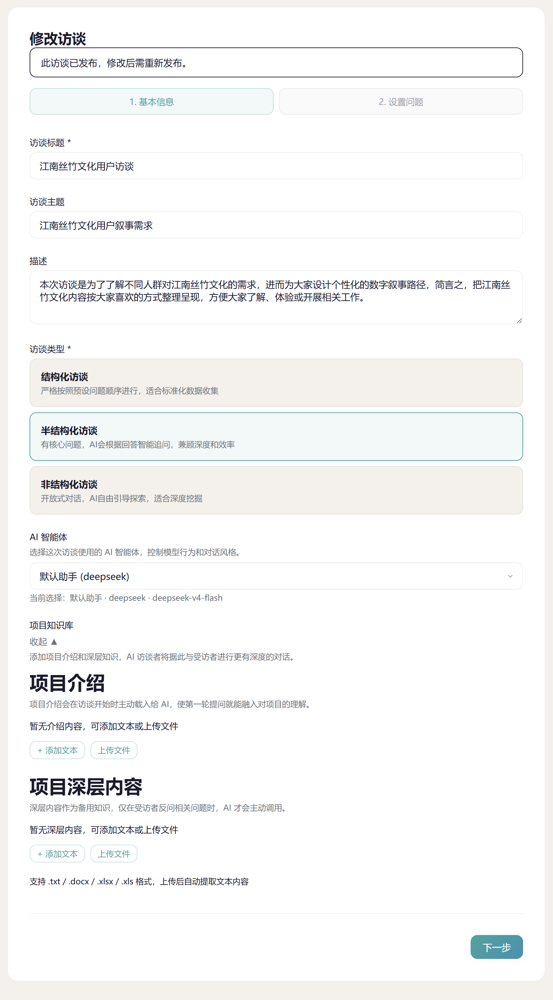
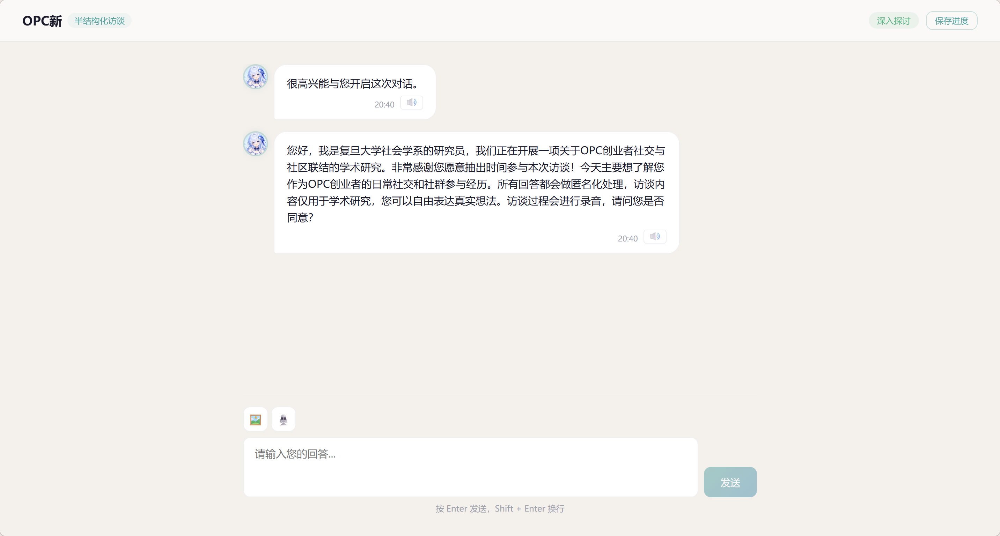
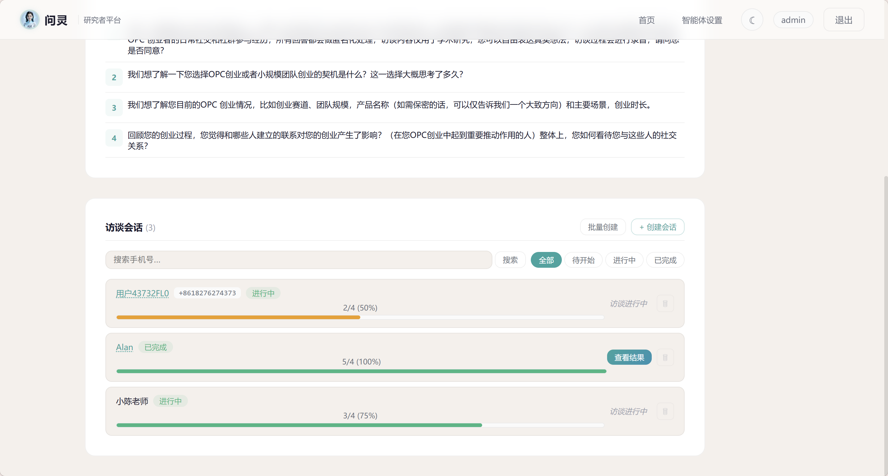
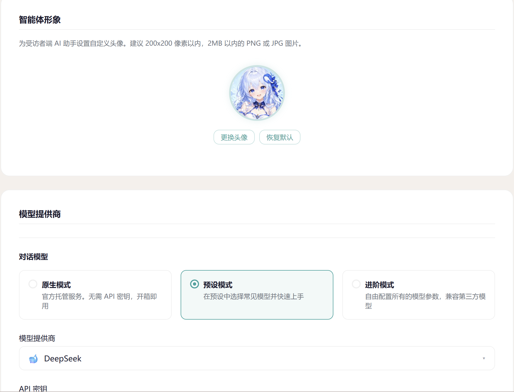
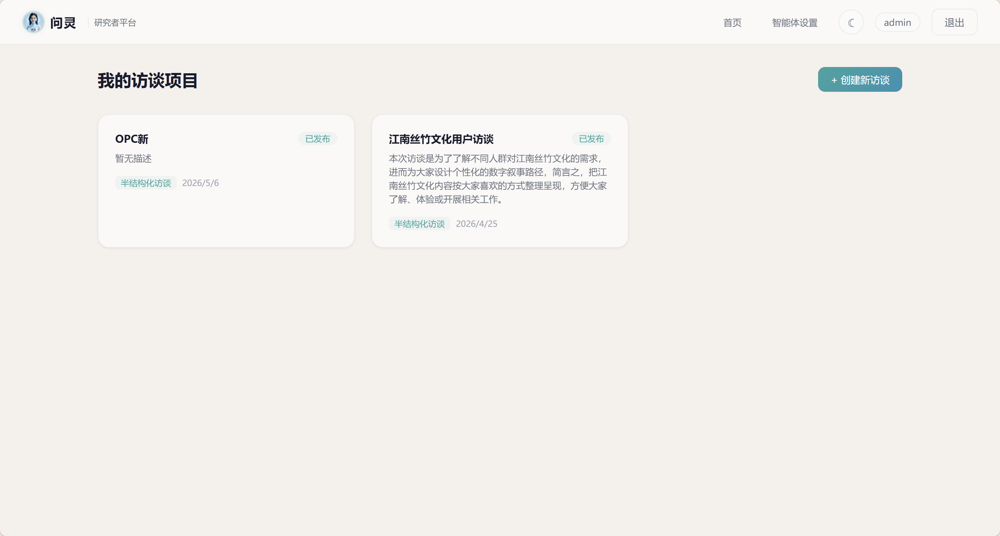
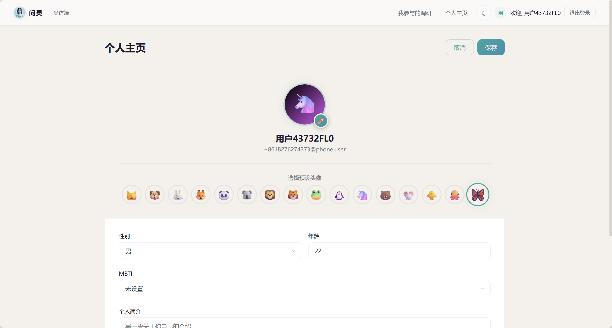

# 问灵 Wenling - AI驱动的自动化访谈引擎


## 项目简介

**问灵 Wenling** 是面向社科研究者的AI访谈助手。研究者设计访谈框架，AI以人格化方式与受访者自然对话——倾听、回应、追问、过渡，像真人访谈者一样进行深度访谈。



## 核心功能

### 🎯 设计访谈框架

填写主题、描述、预设问题，选择访谈类型（结构化、半结构化或非结构化）。可设置追问次数上限、超时时间、AI温度等参数，甚至自定义系统提示词模板来塑造AI访谈者的人格。

- 创建访谈项目：主题、描述、预设问题
- 选择访谈类型：结构化/半结构化/非结构化
- 设置访谈参数：追问次数、超时、温度
- 系统提示词模板：内置或自定义AI人格

### 🤖 AI智能访谈



AI以访谈者人格与受访者对话：自然开场、倾听回应、灵活追问、温暖收尾。后台实时记录每个预设目标的覆盖状态，三种模式的追问策略不同：

- **结构化访谈**：严格按序，无追问
- **半结构化访谈**：任意顺序，每话题≤N次追问
- **非结构化访谈**：目标仅参考，自由探索≤M轮

### 🎭 3D Avatar数字人（开发中，下一步核心开发计划）

受访者端展示可交互的3D Avatar数字人，说话口型同步（重要），呼吸起伏、眨眼、头部轻晃等微动画，营造温暖的访谈氛围。

- 表情切换：微笑、感兴趣、温暖、思考
- 微动画：呼吸起伏、眨眼、头部轻晃
- 淡蓝科技光效：下颌线、盘扣、发夹
- 响应式布局：桌面侧栏/移动端顶部

### 📊 研究者管理端



完整的访谈生命周期管理：创建、发布、监控、分析。

- 访谈CRUD：创建/编辑/删除/发布
- 会话管理：创建/查看访问码/删除
- 状态筛选：草稿/已发布/已结束
- 进度条显示：直观展示访谈进展

### ⚙️ 智能体全局配置



灵活的AI服务配置：原生服务兑换码激活，或自备API密钥接入主流模型。

- **原生服务**：兑换码激活，无需API密钥
- **多模态**：图片识别开关+提供商选择
- **ASR语音识别**：OpenAI Whisper/阿里云百炼
- **TTS语音合成**：音色选择+试听

支持的AI模型：
- Anthropic Claude
- OpenAI GPT
- DeepSeek
- Moonshot Kimi
- Google Gemini
- MiniMax
- 阿里云百炼
- 更多接入中...

### 📈 结果分析与导出

每轮问答的时间戳、AI动作、覆盖目标完整记录。话题覆盖度可视化展示预设目标完成比例，AI自动生成访谈摘要。

- 对话流完整展示：时间戳 + AI动作
- 话题覆盖度可视化：预设目标完成比例
- AI生成访谈摘要：核心发现与洞察
- 导出功能：HTML / JSON / Markdown

## 支持与联系

### 支持我们

如果问灵对你的研究有帮助，欢迎支持开发者，请联系我，我们约一个coffee chat或者约饭都可以~

### 联系开发者

添加微信入内测群、获取最新动态、反馈使用体验：


> 扫码添加微信，备注「问灵」入内测群

---

## 用户体系

### 研究者端



完整的用户认证体系：注册、登录、个人资料管理。

- 注册：用户名+密码，支持邀请码验证
- 登录：JWT认证，Token持久化
- 个人资料：显示名称、邮箱、头像
- 头像上传：PNG/JPG，限制2MB / 200x200px

### 受访者端



无需注册，输入访问码即可开始访谈。

- 访问码输入：无需注册，直接进入访谈
- 受访者资料：昵称、性别、年龄、头像（可选）
- 进度展示：访谈进行中显示话题覆盖进度

## 快速上手

### 三步开始使用

**第一步：访问系统**

网页端直接访问，无需下载安装。
- **研究者端**：wenling-researcher.com（5.9晚间上线）
- **受访者端**：wenling-respondent.com（5.9晚间上线）

**第二步：研究者登录**

访问研究者端需要注册，使用邀请码进行内测。首次使用会提示配置AI服务商或激活原生服务。

**第三步：创建访谈**

新建访谈项目 → 添加问题 → 发布 → 创建会话 → 把访问码发给受访者。受访者输入访问码即可开始访谈。

> 💡 **最简单的方式**：兑换码激活原生服务——无需任何API密钥配置，开箱即用

## 服务模式

### 网页端服务

- 无需下载安装，浏览器直接访问
- 研究者端和受访者端分离
- 数据安全隔离

### 安全机制

- JWT认证
- 密码加密存储
- API Key后端隔离
- 访问码一次性使用验证

### 本地部署

- 支持本地私有化部署，数据完全掌控
- 定制开发十分容易，可洽谈合作

## 技术栈

- **前端**：HTML5 + CSS3 + JavaScript（原生）
- **设计**：CSS变量驱动主题 + IntersectionObserver滚动动画
- **后端**：Node.js + Express + SQLite
- **认证**：JWT Token
- **AI服务**：支持多种主流LLM提供商
- **多模态**：图片识别、语音识别（ASR）、语音合成（TTS）

## 文件结构

```
wenling-website/
├── index.html              # 主页面（HTML结构）
├── styles.css              # 样式表（CSS）
├── main.js                 # 交互逻辑（JavaScript）
├── README.md               # 项目说明文档
├── LANDING-PAGE.md         # Landing Page设计说明
├── assets/                # 功能截图目录
│   ├── logo.png               # Logo图片
│   ├── interview-settings.png   # 访谈设置界面
│   ├── interview-ui.png         # AI访谈界面
│   ├── interview-manage.png     # 访谈管理界面
│   ├── agentsettings.png        # 智能体配置界面
│   ├── user-dashboard.png       # 用户仪表板
│   ├── profile.png              # 个人资料
│   ├── response-login.png       # 登录响应界面
│   ├── ali-pay.jpg              # 支付宝收款码
│   ├── wx-pay.jpg               # 微信收款码
│   └── wx.jpg                   # 微信联系/内测群
└── 参考资料/                # 参考项目资料
```

## 设计特点

- **配色主题**：黑绿 + 岩石黄（深色主题）
- **响应式设计**：适配桌面/平板/手机
- **动画效果**：滚动渐显、光晕浮动、按钮光泽等
- **单页滚动**：流畅的页面滚动体验
- **无外部依赖**：纯原生实现，加载快速

## 如何预览

直接在浏览器中打开 `index.html` 文件即可预览。

或者使用本地服务器：

```bash
# Python 3
python -m http.server 8080

# Node.js (需要安装 http-server)
npx http-server -p 8080
```

然后访问 `http://localhost:8080`

---

## 联名项目：拾卷 ShiJuan


**拾卷** 是本地优先的智能文献管理工具，支持 PDF、HTML、EPUB、DOCX、TXT、Markdown 等多格式文件管理。

### 核心功能
- **阅读 · OCR · 注释**：选中即注释，OCR识别扫描版PDF
- **AI 深度阅读**：每一句AI回答都能溯源到原文
- **跨文献笔记**：从任意文献的注释中拖拽引用，串联成思考笔记
- **召唤历史名人对话**：与苏格拉底、柏拉图、孔子等历史名人对话
- **Hermes 学徒**：每周自动生成阅读观察报告

访问拾卷官网：[https://easyessay.com.cn](https://easyessay.com.cn)

---

> 本网站设计借鉴自 [拾卷官网](https://easyessay.com.cn)

---

## 许可证

私有项目，仅供研究与演示使用。

---

**问灵 Wenling** © 2026 · AI驱动的自动化访谈引擎
